## Project Spotlight
| Project & Repo | Description | Contributions/Learning | Images | Website |
| --- | --- | --- | --- | --- |
| Procedural Street Generation | A freeform street generator developed for my graduate Procedural Content Generation course. | Generated freeform streets based on a random number seed. Interpolated between street segments in my underlying data structure using Bezier curves to create the 3D street mesh. Procedurally generated rivers and bridges to cross them. Randomly placed buildings alongside streets. Adjusted various paramters to generate different types of street layouts (suburban, grid city, skewed city). |  | [More Images](https://github.com/Joseph-Britt/Joseph-Britt/tree/main/Street%20Generation) |
| [Kitchen Chaos](https://github.com/Joseph-Britt/KitchenChaos) | A game I developed in Unity following a free 11-hour game development course over the summer of 2024. | Design patterns and principles, interfaces, scriptable objects, singleton pattern, observer pattern, generics, UI, state machines (art assets provided) | 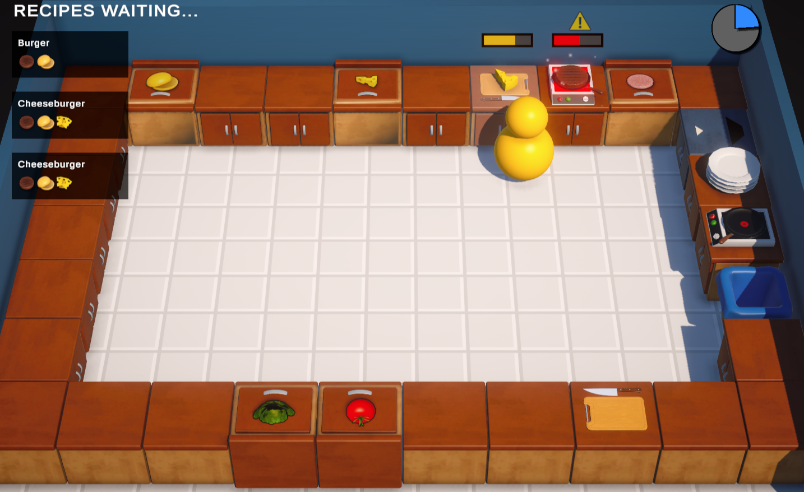 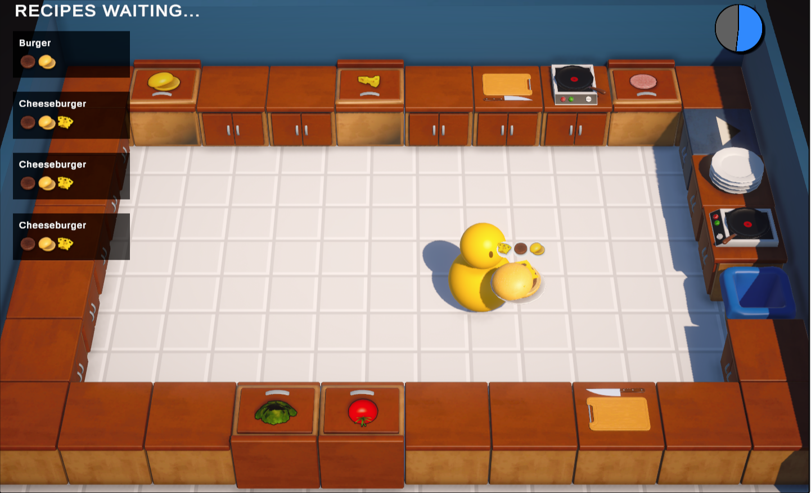 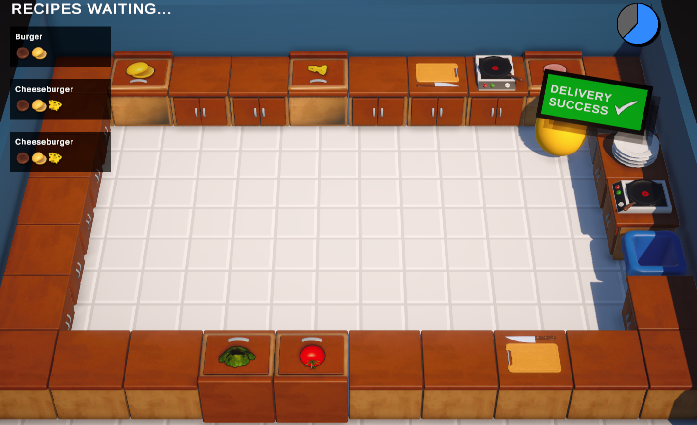 | [Play](https://josephbritt.itch.io/kitchen-chaos) |
| [GrewPrints](https://github.com/PoyoMain/GrewPrints) | A 3D puzzle platformer with an interesting blueprint mechanic to move and resize objects in your environment (GMTK Game Jam 2024). | Blueprint system, moving/scaling objects, level implementation in Unity, level shader for visual clarity |   | [Play](https://poyomain.itch.io/grewprints) |

## Additional Projects
| Project & Repo | Description | Contributions/Learning | Images | Website |
| --- | --- | --- | --- | --- |
| Spotify Wrapped | Spotify-integrated project developed in Android Studio for CS 2340 — Objects & Design in a team of 6 developers (I am not allowed to share the GitHub portfolio for this project publicly). | Managed version control through GitHub, task tracking using kanban scheduling in Trello, Agile methodology, lead developer for the game feaures of our app | *see the website for a breakdown of our process and an app demo at the bottom | [Website](https://sirak720.wixsite.com/spotifywrappedgrou-1) |
| [Interstellar Weedwacker](https://github.com/gZation/DevDev2024Fun) | An action-adventure game where the player must fight through a plant-infested space ship while collecting items that grant powerful abilities... with a catch. Developed for the DevDev game jam 2024 for the theme "What Could Go Wrong?". Was voted second place game. | Enemy implementation (6 unique enemies, including 2 traps), main menu, sentient trowel ability (orbiting weapon), prefab management + asset integration, collaborated with another programmer on refining and debugging procedural level generation for 3 varying levels using a free level generation asset | 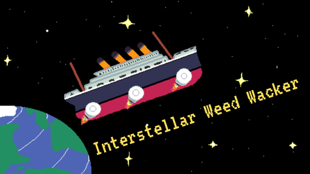 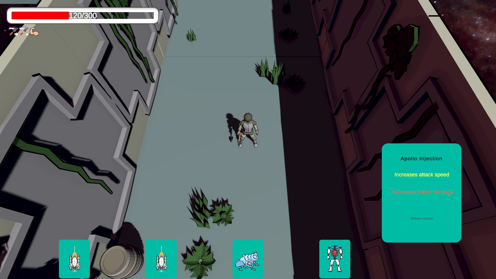 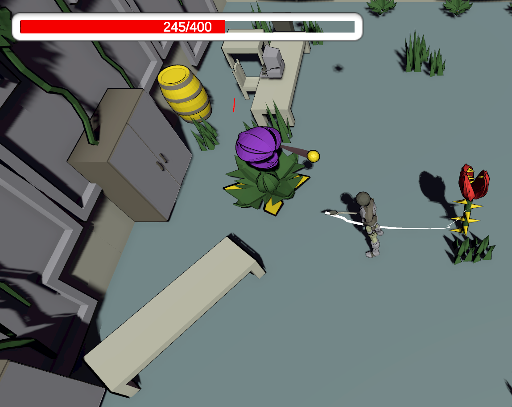 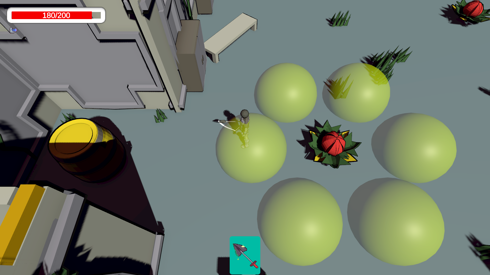 (Images are taken from the final game and represent the contributions of the full team; art was done by other team members) | [Website](https://stinkweed.itch.io/interstellar-weedwacker) |
| [Altarune](https://github.com/Carlijavier5/Altarune) | Altarune follows a not-so-magically-talented mage who uses her mechanical engineering degree to construct towers and fend off enemies (VGDev - fall 2024). | Furnace tower 3D model, lightning tower implementation (in progress), lightning tower chain VFX (in progress) | 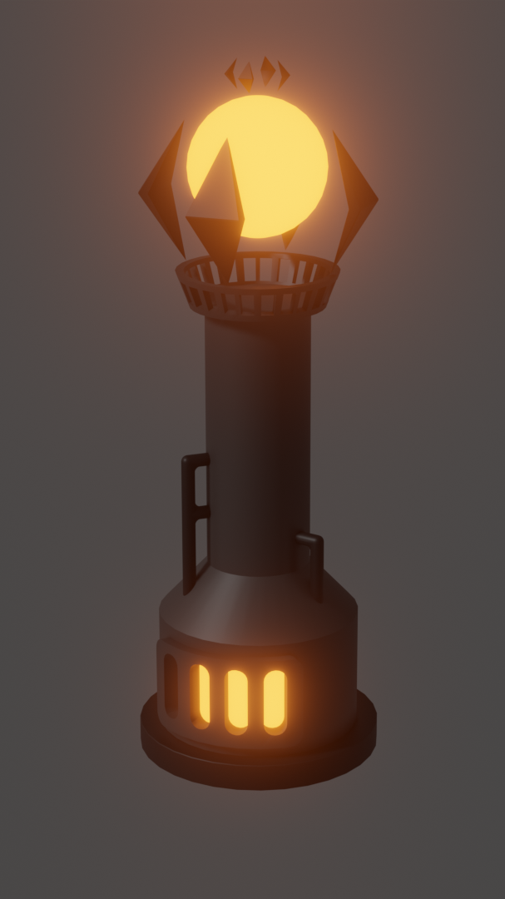 | |
| [Quantum](https://github.com/Chase-rgb/Quantum) | A 2D co-op puzzle platformer between two colliding worlds (VGDev - spring 2024). | Quantum lock lightning VFX, main menu implementation | 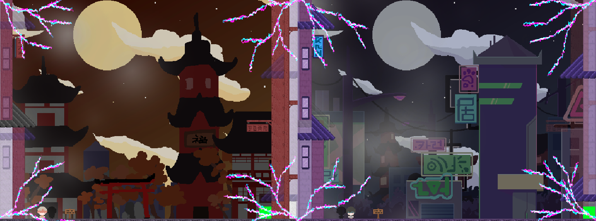(background art created by others) | |
| [Bonbon](https://github.com/chrysly/project-bonbon) | A JRPG game set in a sweets-themed world (VGDev - fall 2023). | Kingdom wall 3D model, attack impact VFX, crystal shader, inventory system sorting method, life steal action | 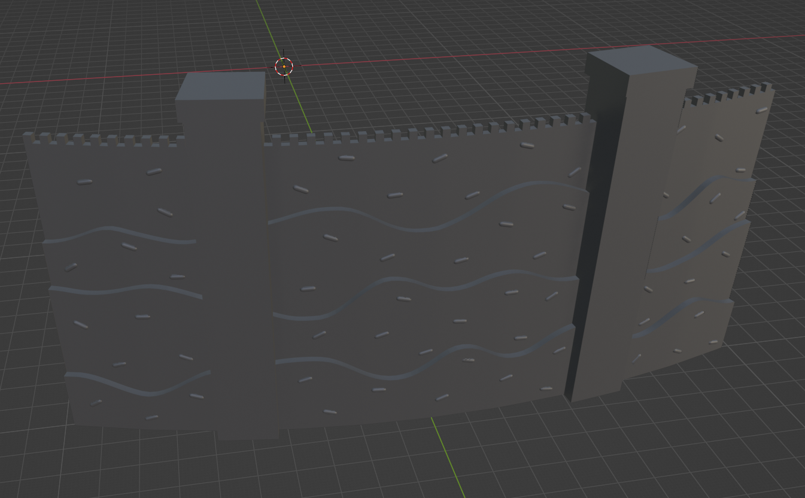  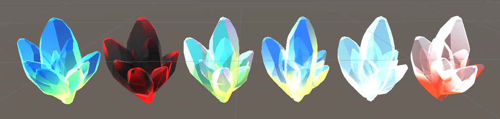 | [Website](https://www.gtvgdev.com/games-archive/bonbon) |
| [Equinox](https://github.com/vittorio-corbo/Equinox) | A 3D puzzle-adventure game set in space (VGDev - fall 2023). | Crate 3D model, light strip 3D model, space ship concept models | 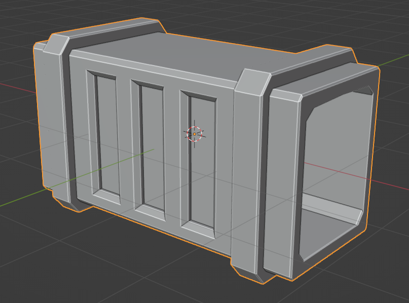  | [Website](https://www.gtvgdev.com/games-archive/epitaph) |
| [Epitaph](https://github.com/Joseph-Britt/epitaph) | A 2D roguelike game following a struggling exorcist (VGDev - fall 2023). | NPC dialogue system | | [Website](https://www.gtvgdev.com/games-archive/equinox) |
| [Turn-Based Strategy Course](https://github.com/Joseph-Britt/TurnBasedStrategyCourse) | A framework for a strategy game in Unity including movement, abilities, enemy AI and pathfinding, and interactive elements in the environment (summer 2024). | Scriptable objects, ragdoll physics, destruction physics, enemy AI using action values, A* pathfinding (art assets provided) | | |

## Interests
### Video Games
I have always loved video games. There is something amazing about the freedom of expression, ability to connect with others, and unique methods of storytelling they allow. During the COVID-19 pandemic, video games provided a means of not just staying in contact with my friends, but interacting together in virtual worlds and making cherished memories together. I have found myself drawn to creating games for a long while now, from planning out ideas for Minecrarft mods I wanted to create as a kid to working on my own original projects through game jams. Here at Georgia Tech, I have relished the opportunity to collaborate with other students on game development projects through VGDev, my school's video game development club. Some of my all-time favorite video games include _Minecraft_, _Hollow Knight_, and _Star Wars Jedi: Fallen Order_.
### Robotics
I competed in VEX Robotics on team 5430A for all 4 years of high school, securing two State Championships, 3 State Excellence Awards, and both a Division Championship and Excellence Award at the 2021 VEX Robotics World Championship. I have enjoyed exploring my passion for robotics further at Georgia Tech with coursework including CS 3630 — Perception & Robotics and CS 3600 — Introduction to Aritifical Intelligence, in which I utilized a variety of techniques such as Markov decision processes, neural network, Monte Carlo localization using a particle filter, PID control, odometry, and sensor fusion to complete a number of tasks and games.
### Dancing
I am a competitive ballroom dancer through the Ballroom Dance Club at Georgia Tech. My partner and I compete at the Silver/Gold level, and we coach the club's Newcomer competitive choreo lessons each Sunday. I am also a board member for the Swing Dance Social Community at Georgia Tech. My favorite swing dance is West Coast Swing, which I have been dancing for nearly three years!
