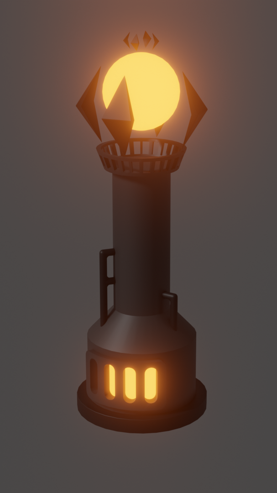
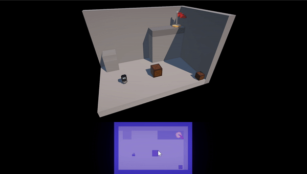
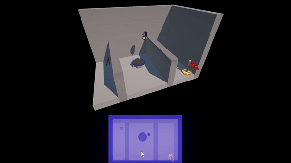
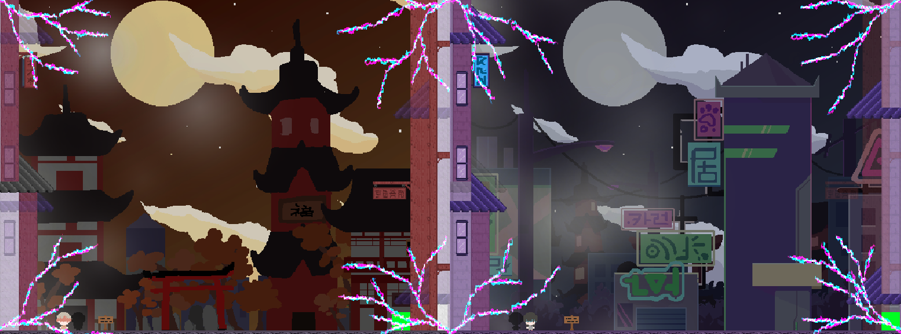
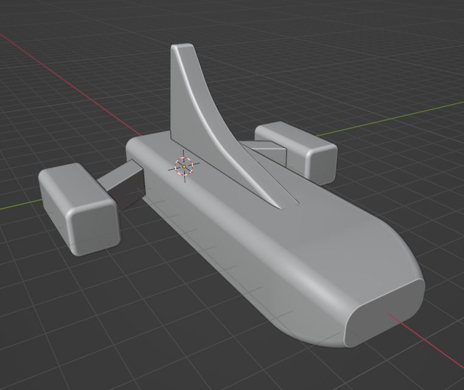
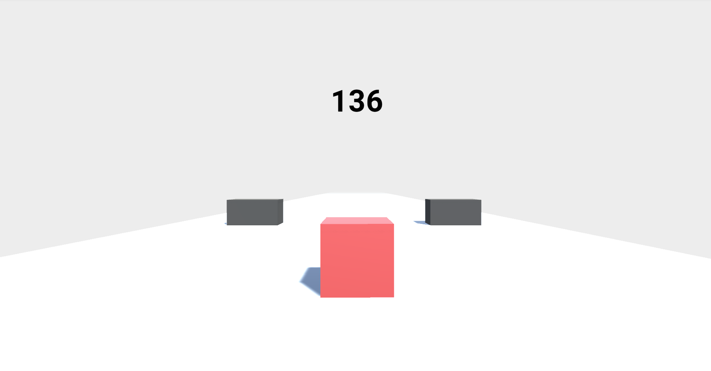

## Introduction
Hello, my name is Joseph Britt, and I am a computer science student at the Georgia Institute of Technology. My thread specializations are Intelligence & Media, and I have interests in game development, computer graphics, and robotics. I am currently looking for a summer 2025 internship in the fields of software and game development.

## Recent Unity Projects
I am currently working on a game called Altarune as part of my school's video game development club. I have had the opportunity to work on a variety of semester-long projects through Georgia Tech's video game development club, VGDev, and I look forward to working on more as well as leading my own game in the future! I also completed several game dev courses and competed in 3 game jams over the summer of 2024.
| Project & Repo | Description | Contributions | Images | Website |
| --- | --- | --- | --- | --- |
| [Altarune](https://github.com/Carlijavier5/Altarune) | This is my current project. It follows a not-so-talented mage who uses her mechanical engineering degree to construct towers and fend off enemies (VGDev). | Furnace tower 3D model, lightning tower implementation (in progress), lightning tower chain VFX (in progress) |  | link |
| [GrewPrints](https://github.com/PoyoMain/GrewPrints) | A 3D puzzle platformer with an interesting blueprint mechanic to move and resize objects in your environment (GMTK Game Jam 2024). | Blueprint system, moving/scaling objects, level implementation in Unity, level shader for visual clarity |   | [Play](https://poyomain.itch.io/grewprints) |
| [Yum yum, Scavenge!](https://github.com/TheStinker/3HourJamming) | A small game made for a 3-hour game jam about a racoon trying to scavenge enough trash from people's trash cans before the sun goes down (Trijam #279). | NavMesh implementation, enemy AI, main menu |  | [Play](https://stinkweed.itch.io/yum-yum-scavenge) |
| [Interstellar Weedwacker](https://github.com/gZation/DevDev2024Fun) |

## Past Unity Projects
| Project & Repo | Description | Contributions | Images | Website |
| --- | --- | --- | --- | --- |
| Kitchen Chaos | A game I developed as part of a free 11-hour game development course (summer 2024). | Programming (art assets provided) | | link |
| Strategy Course | A framework for a strategy game including movement, abilities, enemy AI and pathfinding, and interactive elements in the environment (summer 2024). | Programming (art assets provided) | --- | link |
| [Quantum](https://github.com/Chase-rgb/Quantum) | A 2D co-op puzzle platformer between two colliding worlds (VGDev - spring 2024). | Quantum lock lightning VFX, main menu implementation | (background art created by others) | link |
| [Bonbon](https://github.com/chrysly/project-bonbon) | A JRPG game set in a sweets-themed world (VGDev - fall 2023). | Kingdom wall 3D model, attack impact VFX, crystal shader, inventory system sorting method, life steal action |    | link |
| [Epitaph](https://github.com/Joseph-Britt/epitaph) | A 2D roguelike game following a struggling exorcist (VGDev - fall 2023). | NPC dialogue system | | link |
| [Equinox](https://github.com/vittorio-corbo/Equinox) | A 3D puzzle-adventure game set in space (VGDev - fall 2023). | Crate 3D model, light strip 3D model, space ship concept models |   | link |
| Cube Slider | One of my first solo Unity games. Created following a Brackeys tutorial. | Programming, level design, UI |  | [Play](https://play.unity.com/en/games/e1894537-a508-4521-a41b-f3d6a530155a/cube-slider) |

# Other Past Projects
| Project & Repo | Description | Contributions | Images | Website |
| --- | --- | --- | --- | --- |

## Current Learning
#### CS 2110 — Computer Organization & Programming
I have been learning about how computers work, building from transistors to logic gates to LC-3 assembly language and beyond. We are currently transitioning to C programming!
#### CS 3630 — Introduction to Perception & Robotics
I have learned about a multitude of robotics topics including sensor models, decision theory, image processing, multimodal sensing, differential drive kinematics, state estimation (Particle and Kalman Filters), Markov decision processes, and SLAM. Of our remaining topics, I am particularly looking forward to covering visual odometry and PID control.
#### CS 2050 — Introduction to Discrete Mathematics for Computer Science
This course has taught me a lot ranging from propositional logic and proof techniques (including some particularly interesting ones such as induction, strong induction, proof by cases, and double set containment) to set theory, number theory, and Big O. I am excited for our upcoming analysis of algorithms and cryptography.
#### Technical Art
I have taken in interest in technical art in addition to pure programming and development, and have been enjoying learning about the field and improving my skill set throw my work on VGDev projects.

## Interests
### Video Games
I have always loved video games. There is something amazing about the freedom of expression, ability to connect with others, and unique methods of storytelling they allow. During the COVID-19 pandemic, I really appreciated the ability to not only maintain my relationships with friends, but to grow them and strengthen our bond through our shared experiences. I have long had a curiosity about creating games, from fantasizing about making Minecrarft mods as a kid to dreaming of making my own original games. Here at Georgia Tech, I have finally begun to realize this passion through my involvement with VGDev, the school's video game development club. Some of my favorite video games include _Minecraft_, _Hollow Knight_, and _Star Wars Jedi Fallen Order_.
### Robotics
I competed in VEX Robotics on team 5430A for all 4 years of high school, securing two State Championships, 3 State Excellence Awards, and both a Division Championship and Excellence Award at the 2021 VEX Robotics World Championship. Here at Georgia Tech, I am currently taking CS 3630 — Introduction to Perception & Robotics.
### Dancing
I am a competitive ballroom dancer through the Ballroom Dance Club at Georgia Tech. My partner and I compete at the Bronze/Silver level, and we coach the club's Newcomer competitive choreo lessons each Sunday. I am also a board member for the Georgia Tech Dance Association, the swing dancing club of Georgia Tech. My favorite swing dance is West Coast Swing, which I have been dancing for almost two years!

<!--
**Joseph-Britt/Joseph-Britt** is a ✨ _special_ ✨ repository because its `README.md` (this file) appears on your GitHub profile.

Here are some ideas to get you started:

- 🔭 I’m currently working on ...
- 🌱 I’m currently learning ...
- 👯 I’m looking to collaborate on ...
- 🤔 I’m looking for help with ...
- 💬 Ask me about ...
- 📫 How to reach me: ...
- 😄 Pronouns: ...
- ⚡ Fun fact: ...
-->
