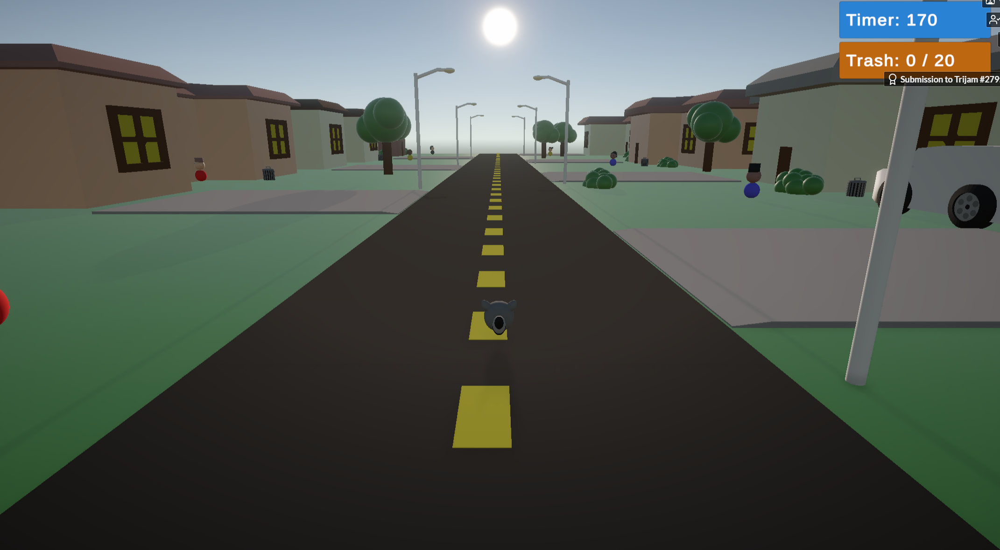

## Introduction
Hello, my name is Joseph Britt, and I am a computer science student at the Georgia Institute of Technology. My thread specializations are Intelligence & Media, and I have interests in game development, computer graphics, and robotics. I am also an admitted BS/MS student and will be taking two graduate courses during the Fall 2025 semester. I am currently seeking internship/co-op opportunities in the fields of software development, artificial intelligence, game development, computer graphics, and robotics.

## Recent Programming Projects
I recently completed my Junior Design Capstone through Georgia Tech's CREATE-X startup program. My team and I researched problems to solve through customer discovery and developed a tractor diagnositcs tool over the Spring 2025 semester to troubleshoot error codes and recommend replacement parts. I have also had the opportunity to work on a variety of semester-long projects through Georgia Tech's video game development club, VGDev, and I look forward to working on more as well as leading my own game in the future! Last summer, I completed several game dev courses and competed in 4 game jams while working part-time. This summer, I have had the opportunity to intern at Rezify AI, working on frontend development in ReactJS.
| Project & Repo | Description | Contributions/Learning | Images | Website |
| --- | --- | --- | --- | --- |
| [Kitchen Chaos](https://github.com/Joseph-Britt/KitchenChaos) | A game I developed in Unity following a free 11-hour game development course over the summer of 2024. | Design patterns and principles, interfaces, scriptable objects, singleton pattern, observer pattern, generics, UI, state machines (art assets provided) |    | [Play](https://josephbritt.itch.io/kitchen-chaos) |
| Spotify Wrapped | Spotify-integrated project developed in Android Studio for CS 2340 — Objects & Design in a team of 6 developers (I am not allowed to share the GitHub portfolio for this project publicly). | Managed version control through GitHub, task tracking using kanban scheduling in Trello, Agile methodology, lead developer for the game feaures of our app | *see the website for a breakdown of our process and an app demo at the bottom | [Website](https://sirak720.wixsite.com/spotifywrappedgrou-1) |
| [Interstellar Weedwacker](https://github.com/gZation/DevDev2024Fun) | An action-adventure game where the player must fight through a plant-infested space ship while collecting items that grant powerful abilities... with a catch. Developed for the DevDev game jam 2024 for the theme "What Could Go Wrong?". Was voted second place game. | Enemy implementation (6 unique enemies, including 2 traps), main menu, sentient trowel ability (orbiting weapon), prefab management + asset integration, collaborated with another programmer on refining and debugging procedural level generation for 3 varying levels using a free level generation asset |     (Images are taken from the final game and represent the contributions of the full team; art was done by other team members) | [Website](https://stinkweed.itch.io/interstellar-weedwacker) |
| [GrewPrints](https://github.com/PoyoMain/GrewPrints) | A 3D puzzle platformer with an interesting blueprint mechanic to move and resize objects in your environment (GMTK Game Jam 2024). | Blueprint system, moving/scaling objects, level implementation in Unity, level shader for visual clarity |   | [Play](https://poyomain.itch.io/grewprints) |
| [Turn-Based Strategy Course](https://github.com/Joseph-Britt/TurnBasedStrategyCourse) | A framework for a strategy game in Unity including movement, abilities, enemy AI and pathfinding, and interactive elements in the environment (summer 2024). | Scriptable objects, ragdoll physics, destruction physics, enemy AI using action values, A* pathfinding (art assets provided) | | |

## Past Prograrmming Projects
| Project & Repo | Description | Contributions/Learning | Images | Website |
| --- | --- | --- | --- | --- |
| [Altarune](https://github.com/Carlijavier5/Altarune) | Altarune follows a not-so-magically-talented mage who uses her mechanical engineering degree to construct towers and fend off enemies (VGDev). | Furnace tower 3D model |  | |
| [Quantum](https://github.com/Chase-rgb/Quantum) | A 2D co-op puzzle platformer between two colliding worlds (VGDev - spring 2024). | Quantum lock lightning VFX, main menu implementation | (background art created by others) | |
| [Bonbon](https://github.com/chrysly/project-bonbon) | A JRPG game set in a sweets-themed world (VGDev - fall 2023). | Kingdom wall 3D model, attack impact VFX, crystal shader, inventory system sorting method, life steal action |    | [Website](https://www.gtvgdev.com/games-archive/bonbon) |
| [Yum yum, Scavenge!](https://github.com/TheStinker/3HourJamming) | A small game made for a 3-hour game jam about a racoon trying to scavenge enough trash from people's trash cans before the sun goes down (Trijam #279). | NavMesh implementation, enemy AI, main menu |  | [Play](https://stinkweed.itch.io/yum-yum-scavenge) |
| [Equinox](https://github.com/vittorio-corbo/Equinox) | A 3D puzzle-adventure game set in space (VGDev - fall 2023). | Crate 3D model, light strip 3D model, space ship concept models |   | [Website](https://www.gtvgdev.com/games-archive/epitaph) |
| [Epitaph](https://github.com/Joseph-Britt/epitaph) | A 2D roguelike game following a struggling exorcist (VGDev - fall 2023). | NPC dialogue system | | [Website](https://www.gtvgdev.com/games-archive/equinox) |
| Cube Slider | One of my first solo Unity games. Created following a Brackeys tutorial. | Programming, level design, UI |  | [Play](https://play.unity.com/en/games/e1894537-a508-4521-a41b-f3d6a530155a/cube-slider) |

## Recent Learning
#### CS 3451 — Computer Graphics
#### CS 4731 — CREATE-X Capstone
#### CS 3510 — Design & Analysis of Algorithms
I learned about a variety of topics spanning divide & conquer algorithms, graph algorithms, dynamic programming, and complexity theory while completing weekly proof-writing homework assignments. I really enjoyed the process and challenge of algorithm design and found the topics in this course fascinating.
#### Technical Art
I have taken in interest in technical art in addition to pure programming and development, and have been enjoying learning about the field and improving my skill set through my work on VGDev projects.

## Interests
### Video Games
I have always loved video games. There is something amazing about the freedom of expression, ability to connect with others, and unique methods of storytelling they allow. During the COVID-19 pandemic, I really appreciated the ability to not only maintain my relationships with friends, but to grow them and strengthen our bond through our shared experiences. I have long had a curiosity about creating games, from fantasizing about making Minecrarft mods as a kid to dreaming of making my own original games. Here at Georgia Tech, I have finally begun to realize this passion through my involvement with VGDev, the school's video game development club. Some of my favorite video games include _Minecraft_, _Hollow Knight_, and _Star Wars Jedi Fallen Order_.
### Robotics
I competed in VEX Robotics on team 5430A for all 4 years of high school, securing two State Championships, 3 State Excellence Awards, and both a Division Championship and Excellence Award at the 2021 VEX Robotics World Championship. Here at Georgia Tech, I am currently taking CS 3630 — Introduction to Perception & Robotics.
### Dancing
I am a competitive ballroom dancer through the Ballroom Dance Club at Georgia Tech. My partner and I compete at the Bronze/Silver level, and we coach the club's Newcomer competitive choreo lessons each Sunday. I am also a board member for the Georgia Tech Dance Association, the swing dancing club of Georgia Tech. My favorite swing dance is West Coast Swing, which I have been dancing for almost two years!

<!--
**Joseph-Britt/Joseph-Britt** is a ✨ _special_ ✨ repository because its `README.md` (this file) appears on your GitHub profile.

Here are some ideas to get you started:

- 🔭 I’m currently working on ...
- 🌱 I’m currently learning ...
- 👯 I’m looking to collaborate on ...
- 🤔 I’m looking for help with ...
- 💬 Ask me about ...
- 📫 How to reach me: ...
- 😄 Pronouns: ...
- ⚡ Fun fact: ...
-->
